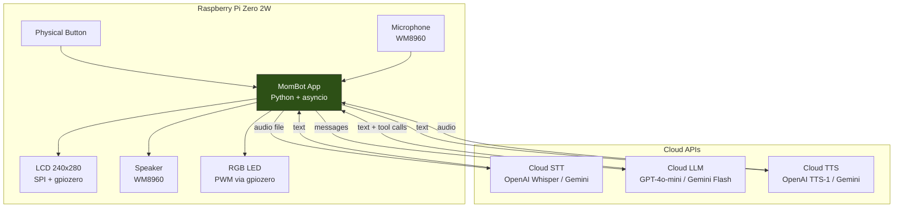
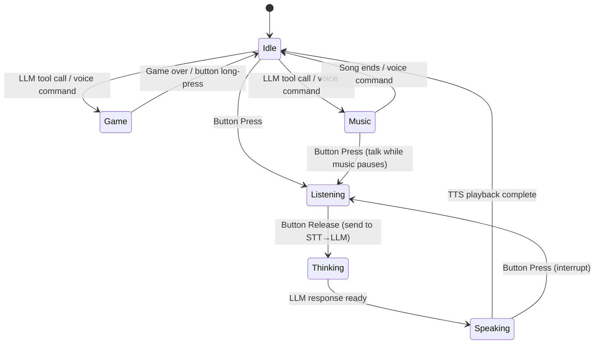

# MomBot Build Plan

## Objective

Build a warm, friendly AI companion device on Raspberry Pi Zero 2W + Whisplay HAT that can:
- **Chat conversationally** via voice (press-to-talk, cloud STT/LLM/TTS)
- **Play songs** from local MP3 files (LLM-triggered or button-triggered)
- **Play simple games** (tic-tac-toe via voice + LCD, brick breaker via button + LCD)
- **Display status/emoji/text** on the 240x280 LCD
- **Run reliably** as a pure Python app with modern dependencies

---

## Architecture Overview



### Key Architectural Decisions

| Decision | Choice | Rationale |
|----------|--------|-----------|
| Language | **Pure Python** | Single codebase, eliminates Node.js↔Python socket bridge, saves ~80MB RAM |
| GPIO | **gpiozero + rpi-lgpio** | Official replacement for deprecated RPi.GPIO |
| SPI | **spidev** (unchanged) | Not affected by GPIO deprecation |
| Cloud STT | **OpenAI Whisper API** (default) | Fast, accurate, cheap ($0.006/min) |
| Cloud LLM | **GPT-4o-mini** (default) | Fast, cheap ($0.15/1M input), supports function calling |
| Cloud TTS | **OpenAI TTS-1** (default) | Natural voices, low latency |
| Audio I/O | **sox** (record) + **pygame** (playback) | Proven on Pi, pygame handles MP3 natively |
| Alt Cloud | **Gemini Flash** for all 3 | Free tier generous, good alternative |
| Display | **PIL/Pillow** + RGB565 via SPI | Already proven in existing code |

---

## Project Structure

```
newApp/
├── plan.md                 # This plan
├── requirements.txt        # Python deps
├── .env.template           # Config template
├── install.sh              # Setup script for Pi
├── run.sh                  # Launch script
├── startup.sh              # Systemd service setup
│
├── main.py                 # Entry point + asyncio event loop
├── config.py               # .env loading + validation
│
├── driver/
│   ├── __init__.py
│   └── whisplay.py         # Modernized driver (gpiozero + spidev)
│
├── core/
│   ├── __init__.py
│   ├── state_machine.py    # App states: idle → listening → thinking → speaking → idle
│   ├── companion.py        # System prompt / personality for mom
│   └── conversation.py     # Chat history management (auto-reset after 5min idle)
│
├── services/
│   ├── __init__.py
│   ├── stt.py              # Cloud STT (OpenAI / Gemini)
│   ├── tts.py              # Cloud TTS (OpenAI / Gemini)
│   ├── llm.py              # Cloud LLM with function calling (OpenAI / Gemini)
│   └── audio.py            # Recording (sox/arecord) + Playback (pygame)
│
├── features/
│   ├── __init__.py
│   ├── music_player.py     # MP3 player: browse, play, pause, skip
│   ├── tools.py            # LLM function-call tools (play_song, set_volume, start_game, etc.)
│   └── games/
│       ├── __init__.py
│       ├── base.py         # Base game class (render loop, input handling)
│       ├── tic_tac_toe.py  # Voice-controlled tic-tac-toe vs LLM
│       └── brick_breaker.py# Button-controlled brick breaker
│
├── ui/
│   ├── __init__.py
│   ├── renderer.py         # Render thread (30fps, composites layers)
│   ├── screens.py          # Screen layouts: idle, chat, game, music, image
│   └── utils.py            # Color/text/image utilities (from existing utils.py)
│
└── assets/
    ├── fonts/              # NotoSansSC-Bold.ttf
    ├── emoji_svg/          # Emoji SVGs
    ├── images/             # Logo, idle images
    └── music/              # User's MP3 collection
```

---

## Step-by-Step Implementation Plan

### Step 1: Modernized Whisplay Driver

**Target**: `newApp/driver/whisplay.py`

Rewrite `Whisplay/Driver/WhisPlay.py` replacing all `RPi.GPIO` calls with `gpiozero`:

| Old (RPi.GPIO) | New (gpiozero) |
|-----------------|-----------------|
| `GPIO.setmode(GPIO.BOARD)` | Not needed (gpiozero handles it) |
| `GPIO.setup(pin, GPIO.OUT)` | `OutputDevice(pin)` |
| `GPIO.PWM(pin, freq)` | `PWMOutputDevice(pin, frequency=freq)` |
| `pwm.ChangeDutyCycle(dc)` | `pwm.value = dc / 100` |
| `GPIO.setup(pin, GPIO.IN, pull_up_down=GPIO.PUD_UP)` | `Button(pin, pull_up=True)` |
| `GPIO.add_event_detect(pin, GPIO.BOTH, callback=fn)` | `button.when_pressed = fn` / `button.when_released = fn` |
| `GPIO.output(pin, HIGH/LOW)` | `device.on()` / `device.off()` |
| `GPIO.cleanup()` | `device.close()` (or context manager) |

**Pin mapping note**: gpiozero uses BCM numbering by default. The existing code uses BOARD pin numbers. We'll use `BOARD_TO_BCM` mapping:
- BOARD 13 (DC) → BCM 27
- BOARD 7 (RST) → BCM 4
- BOARD 15 (LED) → BCM 22
- BOARD 22 (RED) → BCM 25
- BOARD 18 (GREEN) → BCM 24
- BOARD 16 (BLUE) → BCM 23
- BOARD 11 (BUTTON) → BCM 17

`spidev` usage stays unchanged.

**Verification**: Import driver on Pi, init board, confirm LCD displays solid color, LED cycles RGB, button callback fires.

---

### Step 2: Configuration & Project Scaffold

**Targets**: `newApp/config.py`, `newApp/.env.template`, `newApp/requirements.txt`, `newApp/main.py`

- `config.py`: Load `.env` with `python-dotenv`, validate required keys
- `.env.template`: Cloud API keys (OPENAI_API_KEY or GEMINI_API_KEY), STT/LLM/TTS provider selection, system prompt override, initial volume
- `requirements.txt`:
  ```
  gpiozero
  rpi-lgpio
  spidev
  Pillow
  numpy
  cairosvg
  pygame
  openai
  google-generativeai
  python-dotenv
  aiohttp
  ```
- `main.py`: asyncio event loop, init driver, init state machine, start render thread

**Verification**: `python3 main.py` starts without import errors (on Pi).

---

### Step 3: Audio Service (Recording + Playback)

**Target**: `newApp/services/audio.py`

- **Record**: Use `subprocess` to call `arecord` (WM8960 soundcard) → save as WAV
  - `arecord -D hw:wm8960soundcard -f S16_LE -r 16000 -c 1 <output.wav>`
  - Manual start/stop via subprocess (press-to-talk)
- **Playback**: Use `pygame.mixer` for MP3/WAV playback
  - Non-blocking playback with callbacks for completion
  - Volume control via `amixer` (WM8960)
- **Volume**: Wrapper around `amixer -D hw:wm8960soundcard sset Speaker <level>`

**Verification**: Record 5s audio, play it back through speaker.

---

### Step 4: Cloud STT Service

**Target**: `newApp/services/stt.py`

- **OpenAI Whisper API**: Send WAV file → get text back
  ```python
  client = openai.OpenAI(api_key=...)
  result = client.audio.transcriptions.create(model="whisper-1", file=audio_file)
  ```
- **Gemini alternative**: Use Gemini's audio understanding
- Provider selected via `.env` `STT_PROVIDER=openai|gemini`

**Verification**: Record "hello world", send to API, confirm text back.

---

### Step 5: Cloud LLM Service with Function Calling

**Target**: `newApp/services/llm.py`

- **OpenAI GPT-4o-mini**: Streaming chat completion with tool/function calling
- **Gemini Flash alternative**: Same interface, different backend
- **Function calling tools** (registered in `features/tools.py`):
  - `play_song(name)` -- search and play MP3
  - `list_songs()` -- list available songs
  - `set_volume(percent)` -- adjust volume
  - `start_game(game_name)` -- launch tic-tac-toe or brick breaker
  - `make_game_move(position)` -- LLM's move in tic-tac-toe
- **Streaming**: Partial text callbacks for live display updates

**Verification**: Send "hello" to LLM, get streamed response, display on LCD.

---

### Step 6: Cloud TTS Service

**Target**: `newApp/services/tts.py`

- **OpenAI TTS-1**: Text → MP3/WAV audio
  ```python
  response = client.audio.speech.create(model="tts-1", voice="nova", input=text)
  ```
- **Gemini TTS alternative**
- Sentence-by-sentence streaming: split LLM output into sentences, TTS each, play sequentially (same pattern as existing `StreamResponsor.ts`)

**Verification**: TTS "Hello, I'm your new companion!" → play through speaker.

---

### Step 7: UI Renderer & Screens

**Targets**: `newApp/ui/renderer.py`, `newApp/ui/screens.py`, `newApp/ui/utils.py`

Port and clean up from existing `chatbot-ui.py` and `utils.py`:

- **RenderThread**: 30fps loop, composites current screen to LCD via `draw_image()`
- **Screens**:
  - **Idle**: Emoji + status + "press to talk" text + battery
  - **Listening**: Green LED, "Listening..." status, waveform animation (optional)
  - **Thinking**: Orange LED, thinking text scroll
  - **Speaking**: Blue LED, response text scroll
  - **Music**: Song name + progress + album art placeholder
  - **Game**: Game-specific render (tic-tac-toe grid / brick breaker)
- **Utils**: Port `ColorUtils`, `ImageUtils`, `TextUtils`, `EmojiUtils` from existing `utils.py`

**Verification**: Cycle through screens manually, confirm correct rendering.

---

### Step 8: State Machine (Core App Flow)

**Target**: `newApp/core/state_machine.py`



- Manage state transitions with callbacks
- Button press/release from driver triggers transitions
- Each state configures: LED color, screen, button behavior

**Verification**: Full flow: press → listen → STT → LLM → TTS → speak → idle.

---

### Step 9: Companion Personality

**Target**: `newApp/core/companion.py`

System prompt crafted for mom's companion:
- Warm, friendly, patient tone
- Knows it's a little device sitting on a table
- Can play songs, play games, chat about anything
- Remembers conversation context (within session)
- Auto-resets history after 5min idle (configurable)
- Customizable name via `.env` (default: "Buddy")

---

### Step 10: Music Player Feature

**Target**: `newApp/features/music_player.py`

- Scan `assets/music/` for `.mp3` files at startup
- **LLM-triggered**: "Play some music" → LLM calls `play_song()` or `list_songs()`
- **Playback**: `pygame.mixer.music` for background playback
- **Controls**: Pause/resume, skip, volume (all via voice → LLM function calls)
- **Display**: Song name on LCD, music note emoji

**Verification**: Copy MP3 to `assets/music/`, ask "play a song", confirm playback.

---

### Step 11: Tic-Tac-Toe Game

**Target**: `newApp/features/games/tic_tac_toe.py`

- **Render**: 3x3 grid on 240x280 LCD with X/O markers, current turn indicator
- **Mom's input**: Voice → STT → LLM parses move (e.g., "top left", "center", "bottom right")
- **LLM's turn**: LLM decides its move via function call `make_game_move(position)`
- **Flow**: Mom speaks move → LLM validates → LLM responds + makes its move → TTS announces → render board
- **Win detection**: Check rows/cols/diags, announce winner via TTS

**Verification**: Play a full game via voice commands.

---

### Step 12: Brick Breaker Game

**Target**: `newApp/features/games/brick_breaker.py`

- **Render**: Paddle at bottom, ball, brick grid at top (240x280 fits ~8x4 bricks)
- **Controls**: Button press toggles paddle direction (left↔right), paddle auto-moves
- **Physics**: Simple ball bounce, brick collision
- **Game loop**: Runs at 30fps in render thread, pauses conversation
- **LLM integration**: Chatbot announces score, cheers, game over commentary
- **Exit**: Long-press button to quit back to idle

**Verification**: Launch game, break bricks, confirm smooth rendering.

---

### Step 13: Installation & Deployment Scripts

**Targets**: `newApp/install.sh`, `newApp/run.sh`, `newApp/startup.sh`

- `install.sh`:
  - `sudo apt-get install -y sox libsox-fmt-mp3 python3-pip python3-venv libcairo2-dev`
  - Create venv, install requirements
  - Download fonts + emoji SVGs
  - Run WM8960 audio driver install (from existing `Whisplay/Driver/install_wm8960_drive.sh`)
- `run.sh`: Activate venv, set volume, launch `main.py`
- `startup.sh`: Create systemd service for auto-start on boot

**Verification**: Fresh Pi Zero 2W → run `install.sh` → `run.sh` → working companion.

---

## Dependency Migration Summary

| Old Dependency | Issue | Replacement |
|---------------|-------|-------------|
| `RPi.GPIO` | Deprecated, fails on newer Pi OS | `gpiozero` + `rpi-lgpio` |
| `PIL` (Pillow) | No issue, already modern | Keep `Pillow` (latest) |
| `pandas` | Not actually used in this project | Not needed |
| Node.js + TypeScript | Overhead, dual-runtime | Eliminated (pure Python) |
| TCP socket bridge | Unnecessary complexity | Eliminated (direct calls) |

---

## Implementation Sequence & Verification

| Step | Targets | Depends On | Verification |
|------|---------|------------|--------------|
| 1 | `driver/whisplay.py` | -- | LCD color fill, LED cycle, button callback |
| 2 | `config.py`, `main.py`, scaffold | -- | App starts without errors |
| 3 | `services/audio.py` | Step 1 | Record + playback round-trip |
| 4 | `services/stt.py` | Step 3 | Spoken words → correct text |
| 5 | `services/llm.py`, `features/tools.py` | -- | Chat response streamed to console |
| 6 | `services/tts.py` | Step 3 | Text → audible speech |
| 7 | `ui/renderer.py`, `ui/screens.py` | Step 1 | All screens render correctly |
| 8 | `core/state_machine.py` | Steps 1-7 | Full voice conversation loop |
| 9 | `core/companion.py` | Step 5 | Personality responds warmly |
| 10 | `features/music_player.py` | Steps 3, 5, 8 | "Play a song" works end-to-end |
| 11 | `features/games/tic_tac_toe.py` | Steps 5, 7, 8 | Full game via voice |
| 12 | `features/games/brick_breaker.py` | Steps 1, 7 | Game plays smoothly on LCD |
| 13 | `install.sh`, `run.sh`, `startup.sh` | All above | Clean Pi → working device |

---

## Definition of Done

- [ ] App runs as a single Python process on Pi Zero 2W (< 200MB RAM)
- [ ] Voice conversation works: press → talk → AI responds via speaker
- [ ] Music plays on demand (voice-triggered or LLM-triggered)
- [ ] Tic-tac-toe playable via voice against the LLM
- [ ] Brick breaker playable via button on LCD
- [ ] LCD shows status, emoji, text, battery level
- [ ] RGB LED indicates current state
- [ ] Auto-starts on boot via systemd
- [ ] No RPi.GPIO dependency (fully on gpiozero + rpi-lgpio)
- [ ] Works on Raspberry Pi Zero 2W with Whisplay HAT
